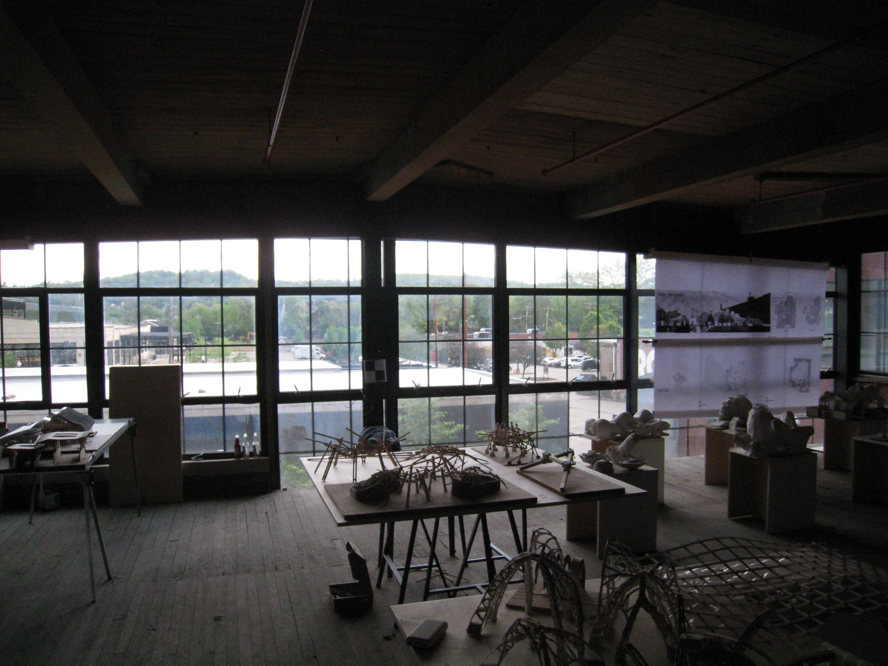

Welcome! Find my projects below.

---

## Selected Work

### [Experience 2D Sketches](https://github.com/ryanw-2/w2)
Processing architecture hand sketches into 3D walkthrough environments and StableDiffusion-powered moodboard generator.

*Full pipeline walkthrough user demo*

---

### [Bamboo Greenhouse Virtual Twin](https://github.com/ryanw-2/sankofa_twin)
Predictive greenhouse conditions simulation engine for resource optimization, education, and outreach.

*Intended client use demo*

---

### [CMU Maps](https://github.com/ScottyLabs/cmumaps)
Front-End Developer working on Carnegie Mellon's go-to app for finding food, classes, and events all across campus.

*Key desktop app features*

---

### [Taskman](https://github.com/ryanw-2/taskman)
Playful experimentation with hand gesture and voice-controlled interface

*Intended client use demo*

---

## Skills & Technologies

Languages: Python, Java, C/C++, JavaScript, HTML, CSS, C#, SQL
Frameworks/Libraries: React, Vite, Three.js, Tensorflow, OpenCV
Tools/Platforms: Git, Docker, Google Cloud, Arduino, Unity, NumPy, Pandas, MATLAB, Grasshopper
Coursework: Data Structures and Algorithms, Functional Programming, Computer Systems, Computer Vision

---

## Education & Certifications

I'm a Carnegie Mellon University student studying Computer Science and Architecture, graduating in 2027.

---

## Contact Information

- **Email:** [ryanw2@andrew.cmu.edu](mailto:ryanw2@andrew.cmu.edu)
- **LinkedIn:** [linkedin.com/in/ryw2](https://linkedin.com/in/ryw2)
- **Portfolio:** [ryanw2.com](https://ryanw2.com)

---

*Last updated: 07/23/2025*
