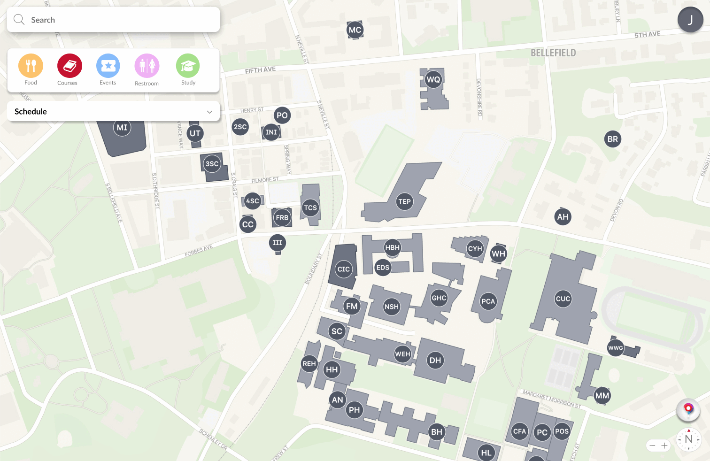

Welcome! Find my projects below.

I’m a Carnegie Mellon Computer Science and Architecture student passionate about building immersive, user-driven 3D experiences. 
My goal for the upcoming semester is to work on real application research involving design, computer vision, robotics, and machine learning!

---

## Selected Work

### [Experience 2D Sketches](https://github.com/ryanw-2/w2)
Processing architecture hand sketches into 3D walkthrough environments and Stable Diffusion moodboard generator for quick early stage ideation for students, clients, and professors.

`Unity` `3D Walkthrough` `User-Generated Content` `StableDiffusion`

---

### [CMU Maps](https://github.com/ryanw-2/cmumaps)
Front-End Developer working on Carnegie Mellon's go-to app for finding food, classes, and events all across campus.

`React` `TypeScript` `RESTAPI` `Figma`

---

### [Taskman](https://github.com/ryanw-2/taskman)
Playful experimentation with hand gesture and voice-controlled interface

`OpenCV` `MediaPipe` `VoiceControl` `GestureRecognition` `WebSockets`

---

### [Bamboo Greenhouse Virtual Twin](https://github.com/ryanw-2/sankofa_twin)
Predictive greenhouse conditions simulation engine for resource optimization, education, and outreach.

`Python` `FastAPI` `Streamlit` `TensorFlow` `Physics Based Simulation`

---

## Skills & Technologies

Languages: Python, Java, C/C++, JavaScript, HTML, CSS, C#, SQL  
Frameworks/Libraries: React, Vite, Three.js, Tensorflow, OpenCV  
Tools/Platforms: Git, Docker, Google Cloud, Arduino, Unity, NumPy, Pandas, MATLAB
Coursework: Data Structures and Algorithms, Functional Programming, Computer Systems, Computer Vision
Design: Figma, Photoshop, Illustrator, InDesign, After Effects, Express, Rhino, Grasshopper

---

## Education

I'm a Carnegie Mellon University student studying Computer Science and Architecture, graduating in 2027.

---

## Creative Work

If you are curious of what a Computer Science X Architecture student does, check out some of the design and creative
work that I'm really excited about too. Throughout this process tools like `Photoshop` and `Illustrator` have been
critical in developing linework, renders, and client ready presentations!

### [Designing for Benny](https://www.ryanw2.com/making-of-a-habit)

Accessible architecture for a painter who is visually impaired. Detailed interior design
and drafting work.

`Photoshop` `Illustrator` `Rhino` `Woodworking`

---

### [Story of Mom and Son](https://www.ryanw2.com/the-story-of-mom-and-son)

A study of Lawrenceville, Pittsburgh. A design to bring people together
despite cultural and social differences.

`Photoshop` `After Effects` `Illustrator` `Rhino`

---

## Contact Information

- **Email:** [ryanw2@andrew.cmu.edu](mailto:ryanw2@andrew.cmu.edu)
- **LinkedIn:** [linkedin.com/in/ryw2](https://linkedin.com/in/ryw2)
- **Mobile:** 1 (669)-231-9047

---

*Last updated: 08/15/2025*
